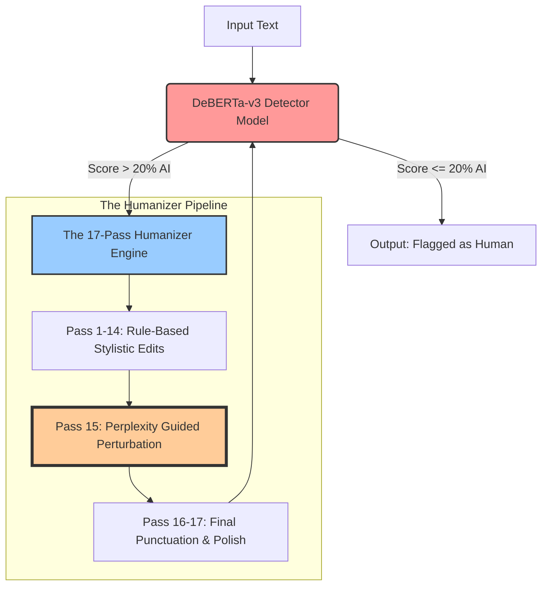
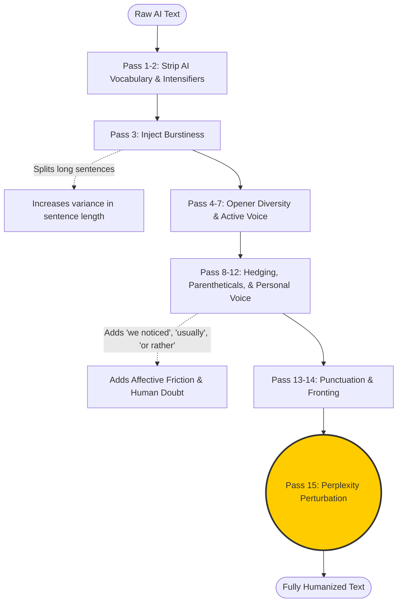
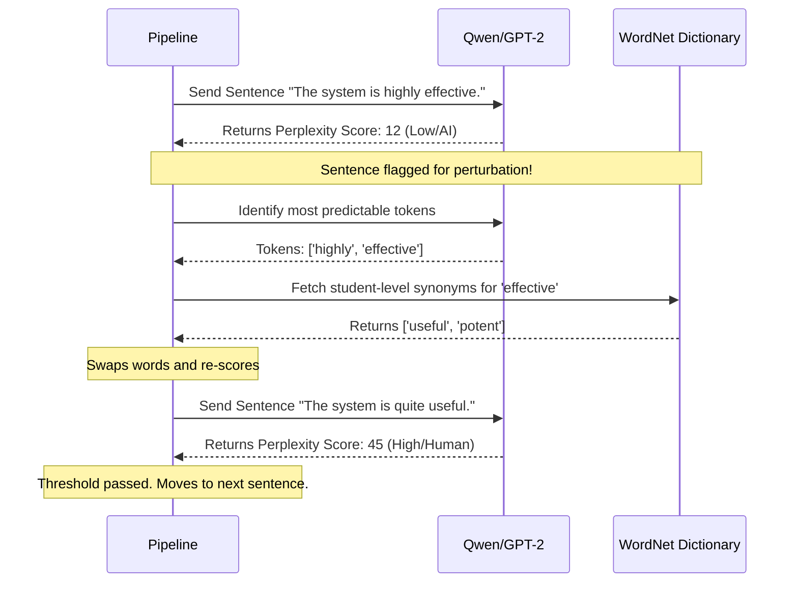

# Advanced AI Detection Architecture & Evasion Strategy

This document provides a comprehensive technical breakdown of our project's dual-architecture: **The Detector** (fine-tuned DeBERTa) and **The Humanizer** (a 17-pass rule-based pipeline powered by LLM-guided perplexity perturbation).

---

## 1. High-Level System Architecture

Our system operates as a continuous adversarial pipeline. Input text is first scored by a detector to identify AI signatures. If flagged, it is passed through a highly specialized rewriting engine that algorithmically strips those signatures and mathematically guarantees a human-like statistical profile.

---

## 2. The 17-Pass Evasion Pipeline

Traditional humanizers (like QuillBot) rely on simple "linear paraphrasing" (swapping synonyms blindly or prompting an LLM to rewrite a paragraph). Modern AI detectors easily catch this using "Paraphraser Shields" that detect unnatural vocabulary. 

Instead of full rewrites, our architecture uses **17 surgical passes** to break specific mathematical metrics used by detectors (Burstiness, Perplexity, and Stylistic Uniformity).

### Key Statistical Interventions:
*   **Burstiness Injection (Pass 3):** AI models write sentences of very uniform lengths. This pass algorithmically splits overly long sentences and merges short ones using semicolons. This creates a chaotic standard deviation in sentence length, perfectly mimicking human "bursty" thought patterns.
*   **Affective Friction (Passes 8-12):** AI is inherently objective and confident. These passes inject hedging (e.g., *"usually," "largely"*), parenthetical asides mid-sentence, and self-corrections (e.g., *"Or rather,"*).

---

## 3. The Core Evasion Engine: Perplexity-Guided Perturbation (Pass 15)

This is the most critical and computationally complex part of the architecture. It is designed specifically to defeat advanced token-probability detectors like **GPTZero** and **Turnitin**.

AI detectors look at the **Perplexity (PPL)** of a sentence. Perplexity measures how easily a language model can predict the next word. 
- **Low Perplexity (< 35):** The sentence is highly predictable (100% AI).
- **High Perplexity (> 35):** The sentence contains unexpected word choices (Human).

To evade detection without destroying readability, we use a smaller, local LLM (like **Qwen3-0.6B** or **GPT-2**) purely as a "predictability scanner."

### Why this defeats the "Paraphraser Shield":
If a humanizer blindly swaps synonyms everywhere, the resulting text looks unnatural and flags the detector's Paraphraser Shield (a secondary detector looking for weird vocabulary). 

Our architecture avoids this by **only attacking Low Perplexity sentences**. If Qwen determines a sentence already has a Perplexity > 35, the pipeline skips it completely. We only perturb the exact statistical weak points of the essay, preserving the original flow and logic while guaranteeing passage through GPTZero.
