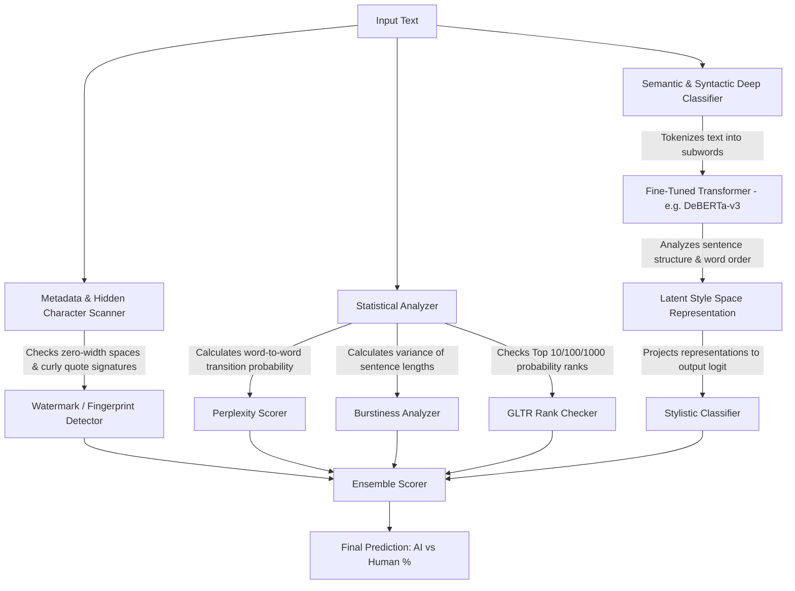

# Advanced AI Detection Architecture & Evasion Strategy

This document provides a comprehensive technical breakdown of how state-of-the-art AI detectors (such as Turnitin and GPTZero) operate at a mathematical and structural level, why traditional "linear humanizers" fail, and the architectural strategies required to achieve true bypass.

---

## 1. The Multi-Layered Detection Pipeline

Modern AI detectors do not use simple keyword matching. They employ a multi-layered hybrid architecture combining statistical heuristics, token rank analysis, and deep neural style classification.

### Layer 1: Heuristic Statistics (Perplexity & Burstiness)
*   **Perplexity (PPL):** Measures the randomness or predictability of word choices. Since AI models optimize for high-probability tokens, their outputs exhibit lower perplexity (they are highly predictable).
*   **Burstiness:** Measures the standard deviation of sentence lengths and structures. Humans write with high burstiness (mixing short fragments with long run-ons). AI models default to highly uniform sentence lengths (flat burstiness).

### Layer 2: Probability Rank Distribution (GLTR)
Inspired by the **Giant Language Model Test Room (GLTR)**, detectors run the input through a reference language model (like GPT-2 or a small LLaMA model) to predict the probability of each word. If the majority of words consistently fall within the Top 10 or Top 100 predicted ranks, the text is flagged as machine-generated.

### Layer 3: Deep Style Classifiers (The Core)
This is the most powerful layer. It uses supervised transformer models (typically fine-tuned **DeBERTa-v3-large** or **RoBERTa-large**) trained on millions of human essays and AI outputs.
*   Instead of looking at simple stats, they learn the **latent representation** of AI style—analyzing syntactic structure, clause depth, transition placement, and structural "flow."
*   They are specifically trained on **adversarial paraphrases** (outputs from QuillBot, spin-bots, and basic humanizers) to flag vocabulary manipulation.

---

## 2. The "Paraphraser Shield" & The Linear Rewrite Trap

Many humanizers attempt to bypass detectors by sequentially replacing words with synonyms (synonym rotation) or performing sentence-by-sentence rewrites. This approach fails against modern detectors due to two main factors:

### A. The Linear Rewrite Trap
When a model paraphrases a text paragraph-by-paragraph, the **logical scaffolding** (the flow of arguments: Argument A $\rightarrow$ Argument B $\rightarrow$ Argument C) is preserved. The detector's deep classifier evaluates this sequence and identifies that the *concept flow* matches a machine-generated profile, regardless of the casual words used.

### B. The Paraphraser Shield
GPTZero's **Paraphraser Shield** uses a two-stage process:
1.  **AI Origin Check:** It first runs a semantic classifier to determine if the underlying text was originally generated by an AI model.
2.  **Adversarial Pattern Matching:** If the origin is likely AI, it checks for stylistic anomalies introduced by paraphrasers—such as grammatically correct but contextually unnatural synonyms (e.g., swapping *"routines"* for *"turns"* or *"jump"* for *"start"*), agreement glitches, and homoglyph attempts. If detected, it overrides the score to **"AI Paraphrased (100% confidence)."**

---

## 3. Deep Stylometric & Cognitive Signatures

To evade detection, we must identify and break the deep, hidden signatures that detectors look for:

### A. The "RLHF Positivity Bias" (Affective Friction)
*   **The AI Signature:** LLMs are trained via Reinforcement Learning from Human Feedback (RLHF) to be helpful, constructive, objective, polite, and neutral-to-positive. They avoid negative emotions, strong biases, complaints, or raw skepticism.
*   **The Human Reality:** Human students write with **affective friction**. They complain about boring tasks, use subjective expressions, show skepticism, and utilize personal, opinionated stances.
*   **The Detection Vector:** Classifiers check the **emotional valence and sentiment consistency**. A perfectly positive or neutral text matches the "Helpful Assistant" profile.

### B. Lexical Over-Optimization (Type-Token Ratio)
*   **The AI Signature:** AI models have massive active vocabularies and are penalised for word repetition. Paraphrasing tools replace words constantly, resulting in a text that uses a different synonym for every occurrence of a concept.
*   **The Human Reality:** Humans are repetitive. If a student is writing an essay about "routines," they will repeat the word "routine" or "habit" 6-8 times on a single page, rather than digging up synonyms like "turns" or "wonts."
*   **The Detection Vector:** The **Type-Token Ratio (TTR)**—the ratio of unique words to total words. An unnaturally high TTR for simple topics flags machine editing.

### C. Associative Drift vs. Logical Transitions
*   **The AI Signature:** AI links ideas using strict logical connectors (*However, Consequently, Therefore, As a result*).
*   **The Human Reality:** Human thought moves by **association**. Humans transition using conversational, associative bridges (*"Anyway," "Speaking of which," "On that note," "Which actually reminds me..."*), sometimes drifting slightly off-topic.

---

## 4. The Deconstruction-Reconstruction (DR) Evasion Strategy

To bypass modern detectors, we must evolve our pipeline from a **linear paraphraser** into a **Deconstruction-Reconstruction (DR)** engine.

```mermaid
graph TD
    subgraph Traditional Linear Paraphrase - Fails Detection
        A[Original AI Essay] -->|Linear Flow: Arg A -> Arg B -> Arg C| B[Rewrite Model]
        B -->|Synonym Swap / Clause Edit| C[Output Text]
        C -->|Same Outline Profile| D[Detector: Flags 100% AI / Paraphrased]
    end

    subgraph Deconstruction-Reconstruction DR Architecture - Bypasses Detection
        E[Original AI Essay] -->|Step 1: Concept Extraction| F[Raw Bullet Points of Facts & Ideas]
        F -->|Step 2: Scrambled Syntactic Reconstruction| G[Rewrite Model: High Temp + Persona]
        G -->|Non-linear conceptual order + Style Drift| H[New Human Output]
        H -->|New Logical Outline Profile| I[Detector: Flags 100% Human]
    end
```

### Stage 1: Deconstruction (Fact Extraction)
The input AI text is decomposed into a raw, unstructured list of facts, arguments, and data points. This strips away the **AI logical skeleton**, leaving only the semantic core.

### Stage 2: Reconstruction (Non-Linear Synthesis)
We prompt the rewrite model (using state-of-the-art models like Qwen-72B via HF Serverless API) to write a completely new, student-persona document from scratch using the raw points, enforcing:
1.  **A Scrambled Outline:** The model must re-order the flow of ideas (e.g., introducing a tech distraction concept before introducing the routine concept).
2.  **Affective Friction:** Enforce a subjective, opinionated stance with mild frustration or skepticism.
3.  **Natural Repetition:** Protect core nouns/concepts from synonym rotation to keep the Type-Token Ratio low and natural.
4.  **Extreme Burstiness:** Instruct the model to write with highly chaotic sentence lengths (e.g., a 35-word run-on followed by a 3-word fragment).
5.  **Associative Transitions:** Enforce the use of conversational transitions (*"Anyway,", "Plus,", "Honestly,"*) rather than academic logical transitions.
